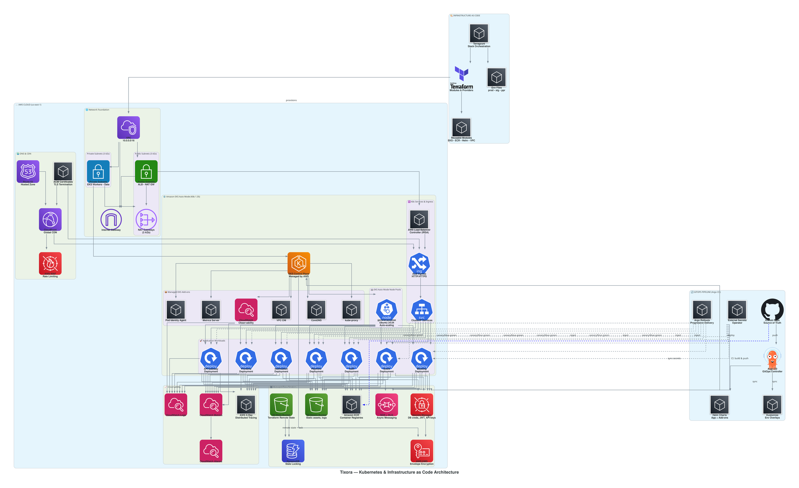

# Tixora — Microservices Event Platform

Production-grade event ticketing platform refactored from monolithic MERN to **decoupled microservices** with full **AWS cloud infrastructure** and **GitOps deployment**.

## 🏗 Architecture



*Figure: Kubernetes & Infrastructure as Code Architecture — AWS Cloud (EKS Auto Mode, VPC, Managed Services) → GitOps Pipeline (Argo CD, Argo Rollouts) → Infrastructure as Code (Terragrunt/Terraform)*

| Service | Port | Responsibility |
|---------|------|----------------|
| API Gateway | 5000 | Ingress, JWT auth, rate limiting, service routing |
| Auth | 5001 | Registration, login, JWT, 2FA OTP |
| Event | 5002 | Catalog, categories, atomic seat management |
| Booking | 5003 | 2FA ticket reservations, admin approval queue |
| Notification | 5004 | SMTP simulator, OTP delivery, booking alerts |
| Payment | 5005 | Transaction processing, revenue analytics |

---

## 🚀 DevOps & Cloud Highlights

### Containerization & Orchestration
- **Multi-service Docker Compose** — 11 containers (6 services + 4 DBs + Redis) with health checks, dependency ordering, named volumes, bridge network
- **Production Dockerfiles** — Multi-stage, non-root, `--production` installs, minimal Alpine base
- **Database-per-service pattern** — Isolated MongoDB instances per microservice

### Infrastructure as Code (Terragrunt/Terraform)
- **Terragrunt stacks** for AWS — modular, DRY, environment-promoted (prod/stg/ppr)
- **EKS Auto Mode** (K8s 1.35, Ubuntu 24.04) — managed node pools, native autoscaling
- **IRSA** for pod-level IAM, **KMS envelope encryption** for secrets
- **Managed EKS add-ons**: VPC-CNI, CoreDNS, kube-proxy, Pod Identity, Metrics Server, CloudWatch Observability
- **Private subnets only** for workers; public ALB/Ingress for app traffic
- **Remote state** in S3 with DynamoDB locking

### GitOps & Continuous Deployment
- **Argo CD** (Helm) — automated sync, Ingress via AWS Load Balancer Controller (IRSA)
- **Argo Rollouts** — progressive delivery, canary/blue-green ready
- **External Secrets Operator** — syncs from AWS Secrets Manager

### Observability & Reliability
- **Health endpoints** on every service (`/health`) with Docker/K8s probes
- **CloudWatch Container Insights** — metrics + logs via EKS add-on
- **Distributed event bus** (Redis Pub/Sub) — async decoupling: `auth.user_registered`, `event.seats_modified`, `booking.created`, `booking.confirmed`
- **Structured logging** & request telemetry via API Gateway

### Security
- **JWT authentication** with short-lived access + refresh tokens
- **EKS endpoint allowlist** (`endpoint_public_access_cidrs`) — restricts `kubectl` to known IPs
- **Secrets in AWS Secrets Manager** — injected via External Secrets, never in repo
- **Private worker nodes** — no public IPs, egress via NAT Gateway

---

## 🛠 Local Development

```bash
# 1. Configure environment
cp .env.example .env   # edit values

# 2. Start full stack
docker compose up -d

# 3. Verify
curl http://localhost:5000/health
```

**Demo credentials:**  
Admin: `admin@tixora.com` / `password123`  
User: `user@tixora.com` / `password123`

---

## ☁ AWS Deployment (Terragrunt)

```bash
cd infra/terragrunt/us-east-1

# Validate & plan
terragrunt hcl format
terragrunt run --all validate
terragrunt run --all --no-stack-generate --filter '!stacks/**' plan

# Apply in dependency order
# kms → vpc → security-groups → ecr → secretsmanager → eks →
# eks-addons → aws-load-balancer-controller → argocd → karpenter → app stacks
```

**Key files:**
- `infra/terragrunt/env.hcl` — shared locals (region, AZs, state bucket, EKS CIDRs)
- `infra/modules/eks_platform/` — EKS cluster + add-ons + IRSA
- `infra/valuefiles/` — Helm values for Argo CD, Rollouts, External Secrets

---

## 📁 Repository Structure

```
tixora/
├── services/                 # 6 microservices (Node.js + Dockerfile each)
├── docker-compose.yml        # Local multi-container orchestration
├── infra/
│   ├── modules/              # Reusable Terraform modules (EKS, ECR, Helm releases)
│   ├── terragrunt/           # Terragrunt stacks (us-east-1 prod/stg/ppr)
│   └── valuefiles/           # Argo CD / Rollouts / External Secrets Helm values
├── argocd-prod/              # Argo CD Application manifests (GitOps)
└── src/                      # React 19 + Vite frontend
```

---

## 🎯 Skills Demonstrated

| Area | Technologies |
|------|--------------|
| **Containerization** | Docker, Docker Compose, Multi-stage builds |
| **Orchestration** | Kubernetes (EKS), Helm, Kustomize-ready |
| **IaC** | Terraform, Terragrunt, Remote state (S3/DynamoDB) |
| **GitOps** | Argo CD, Argo Rollouts, External Secrets Operator |
| **Cloud** | AWS (EKS, VPC, ALB, CloudFront, Route53, KMS, Secrets Manager, CloudWatch, SQS, S3) |
| **CI/CD Patterns** | Stack-based promotion, Dependency-aware apply, Plan validation |
| **Observability** | Health checks, Metrics Server, CloudWatch Container Insights |
| **Security** | IRSA, KMS encryption, Private subnets, Endpoint allowlists, JWT/OAuth |
| **Architecture** | Microservices, Event-driven, Database-per-service, API Gateway pattern |

---

## 📄 License

MIT — feel free to reference for portfolio/resume purposes.