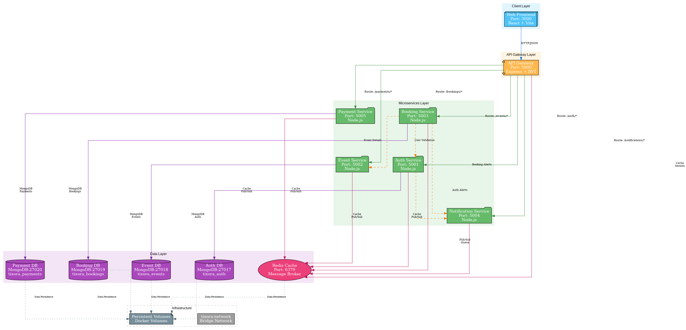

# Tixora Microservices Platform

**Refactored from Monolithic MERN to Decoupled Microservices Architecture**

Tixora is a modern event discovery, ticketing, and booking platform. Originally built as a single monolithic MERN application, this repository has been refactored into a high-concurrency, resilient, and event-driven **Microservices Architecture**.

---

## Architecture Overview

### System Architecture

Tixora implements a **database-per-service** microservices pattern with the following layers:

**Client Layer**
- **Web Frontend** (Port 3000): React 19 + Vite SPA for user interface
- Single-page application communicating via REST API

**API Gateway Layer**
- **API Gateway** (Port 5000): Express-based reverse proxy with JWT authentication
- Routes requests to appropriate microservices
- Handles rate limiting, request telemetry, and service health monitoring
- Connects to Redis for session management and caching

**Microservices Layer**
Each microservice is independently deployable with its own database:

- **Auth Service** (Port 5001): User authentication, JWT token management, 2FA OTP verification
- **Event Service** (Port 5002): Event catalog management, category filters, seat inventory
- **Booking Service** (Port 5003): Ticket reservations, booking state management, admin approval workflow
- **Notification Service** (Port 5004): Email dispatch, 2FA passcode delivery, booking alerts
- **Payment Service** (Port 5005): Transaction processing, payment settlements, revenue analytics

**Data Layer**
- **MongoDB Databases**: 4 separate instances (ports 27017-27020) following database-per-service pattern
- **Redis Cache** (Port 6379): Distributed cache and inter-service message broker (Pub/Sub)
- **Persistent Volumes**: Docker volumes for data persistence across container restarts

**Infrastructure**
- **tixora-network**: Bridge network for inter-service communication
- **Health Checks**: All services implement health checks with dependency-based startup
- **Environment Configuration**: Externalized via `.env` file for security and flexibility

---

## Microservices Breakdown

| Service | Port | Responsibilities | Key Endpoints |
| :--- | :--- | :--- | :--- |
| **API Gateway** | `5000` / `3000` | Ingress routing, JWT verification, rate telemetry, service health | `/api/*` |
| **Auth Service** | `5001` | User registration, login, JWT issuance, 2FA OTP verification | `/api/auth/login`, `/api/auth/register`, `/api/auth/verify-otp` |
| **Event Service** | `5002` | Event catalog, category filters, atomic seating decrement/increment | `/api/events`, `/api/events/:id` |
| **Booking Service** | `5003` | 2FA OTP ticket reservations, attendee booking state, admin approval queue | `/api/bookings`, `/api/bookings/send-otp`, `/api/bookings/:id/confirm` |
| **Notification Service**| `5004` | Simulated SMTP email dispatcher, 2FA passcode delivery, booking alerts | `/api/notifications/inbox`, `/api/notifications/stats` |
| **Payment Service** | `5005` | Transaction processing, payment settlements, revenue telemetry | `/api/payments/process`, `/api/payments/analytics` |

---

## Key Refactoring Improvements

1. **Domain Isolation**: Split monolithic controller methods into distinct microservice boundaries with isolated state.
2. **Event-Driven Messaging**: Asynchronous `eventBus` publishes lifecycle events (`auth.user_registered`, `event.seats_modified`, `booking.created`, `booking.confirmed`, `booking.cancelled`) to decouple inter-service dependencies.
3. **Live 2FA OTP Verification**: Embedded notification simulator allows end-to-end 2FA OTP ticket booking with real-time in-app delivery.
4. **Live Cluster Telemetry**: Built-in architecture dashboard shows real-time request counts, response latency, and cluster health.
5. **Docker Compose Support**: Ready-to-run `docker-compose.yml` for multi-container orchestration.

---

## Quick Demo Credentials
- **Admin**: `admin@tixora.com` / `password123`
- **User**: `user@tixora.com` / `password123`
